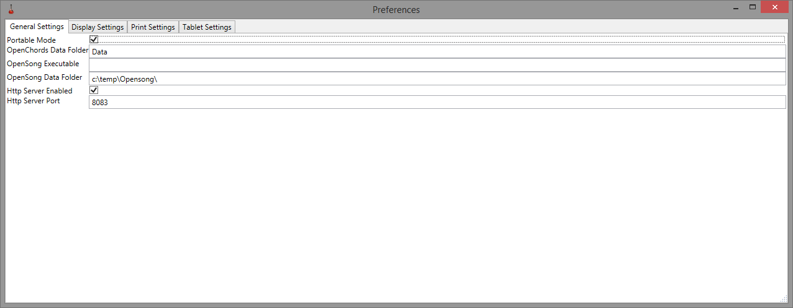
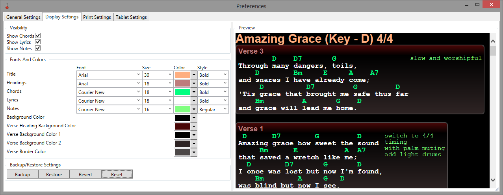

% OpenChords Help Documentation
% Author: Michael van Antwerpen
% Date: 2015-07-04

Overview
========

OpenChords is a song chord chart management and presentation tool for musicians. It allows the user to easily present songs with guitar chords on a computer screen, Its opensource, easy to use, and has a clutter-free interface.

Background
==========

Many years ago I was shown a great open-source application called OpenSong, which I
still use at church for presenting song lyrics to the church congregation. 
I was also the one responsible for the church file of music and this music needed to be
refiled after every practice and every Sunday service. I was then inspired to make
something similar for other musicians. Hence, OpenChords was born.

I now use OpenChords when I play in church and also when I do recording.
I've been developing OpenChords in my free time for for the past six years
years. I hope you enjoy using it as much as I enjoyed making it.

If you wish to contact me for suggestions or to report bugs, you can
email me on <open.chords.app@gmail.com>

Editor Screen
=============

Menu
---------------

Menu Items                        Description                                                       
------------------------------    ----------------------------------------------------------------- 
File    >> Preferences            Change application settings and configure display options         
File    >> Quite                  Exit OpenChords                                                   
Song    >> File Operations        Create/Delete/Save/Revert a song                                  
Song    >> Advanced Search        Search for a song based its title, author, lyrics etc             
Song    >> Song Key               Increase or decrease song key                                     
Song    >> Capo                   Increase or decrease song capo
Song    >> Auto Format Song       Tries to format the song in the OpenChords format
Song    >> Refresh                Refreshes the songs list
Set     >> File Operations        Create/Delete/Save/Revert a set 
Set     >> Refresh                Refreshes the sets list
Present >> Present Song           Present the currently selected song in fullscreen mode
Present >> Present Set            Present the currently selected set in fullscreen mode
Export  >> Export to print        Export to html using the print display settings
Export  >> Export to tablet       Export to html using the tablet display settings
Export  >> Export to openSong     Export songs to be used in OpenSong
Export  >> Export set list        Exports the current set to a text file for easy printing

Song List
---------
This is the list of songs that you have in your song collection.
If you right click on the song you can use the "Add to set" context menu to add the currently selected song into the currently selected set.

**Tip1**: If you want to search for a song, just start typing the name
of the song, and the list will be filtered.

**Tip2**: If you want to get to the song in the file system just click
Song >> File Operations >> Explore options and it will open Windows Explorer with that song
selected.

Shortcut   Description
--------   ----------------------------
Ctrl+Enter Add current song to current set

Sets
--------
A set is simply a name for a list of songs. 

Shortcut   Description
--------   ----------------------------
Del        Remove current song from set
Ctrl+Up    Move song up in the set list
Ctrl+Down  Move song down in the set list
F12        Present current set

Song Metadata
-------------
This is information describing your song.

Title: this is just the name of your song.

Order: This is the order in which you would like the pieces of the song
to appear

~~~~~~~~~~~~~~~~~~~~~~~~~~~~~~~~~~~~~~~~~~~~~~~~~~~~~~~~~~~~~~~~~~~
e.g. V1 C V2 C2 E will display Verse 1, Chorus, Verse 2, Chorus 2,
Ending

There are a number of letters used for pieces of the song:
I = Intro or interlude
C = Chorus
P = Pre-Chorus
B = Bridge
V = Verse
E = Ending

*You can use any other letters and number combinations but only the
*ones above will get converted to more user friendly names when you
*choose to present the song(s)
~~~~~~~~~~~~~~~~~~~~~~~~~~~~~~~~~~~~~~~~~~~~~~~~~~~~~~~~~~~~~~~~~~~

Author: Just the author of the song

Key: Song key

Capo: Capo position

Sharps/Flats: whether you prefer using sharps or flats

Bpm: Beats per minute (used for the metronome)

Tempo: Options are very fast, fast medium, slow, very slow

Time Signature: 2/4, 3/4, 4/4 etc

CCli: Christian Copyright Licensing International

Reference: Other reference information e.g. SOF205

Chords/Lyrics Editor
--------------------
In order to display the chords and lyrics and sections properly we use a
simple syntax.

Syntax       Line description
---------    -------------
"." (dot)    a chord line
" " (space)  a lyrics line
\[x\]        name of the verse where *x* is I, C1, V6 etc

Note Editor
-----------
These notes are to remind you how to perform the song while the song is
being presented in full screen view. e.g. who is introing the song, when does the bass guitarist comes in, who is singing solo parts in the verses. 

Make sure that the notes are in the same order as your presentation order

The Settings Screens
====================

General Settings
----------------

**Note**: you can use both relative and absolute paths.

**Portable Mode** - if this is checked, OpenChords will store its settings file in the same folder where OpenChords is running from "settings.xml". Portable mode is useful if you want to run OpenChords from a flash drive

**OpenChords Data Folder** - this is the folder where OpenChords keeps
its songs, sets, display settings and exported files.

**OpenSong Executable** - The path and executable for OpenSong e.g. "C:\program files (x86)\OpenSong\OpenSong.exe"

**Opensong Songs and Sets Folder** - The path that OpenSong stores its
Songs, Sets, Backgrounds and settings. usually "c:\{userfolder}\My Documents\OpenSong"

**Http Server Enabled** - If this is enabled an embedded http server. note: you might get a firewall warning if this setting is enabled 

**Http Server Port** - The port on which the enbedded http server listens (default 8083)  

~~~~~~~~~~~~~~~~~~~~~~~~~~~~~~~~~~~~~~~~~~~~~~~~~~~~
e.g. 
http://{your ip address}:{selected port}/song will render the currently selected song on another device
http://{your ip address}:{selected port}/set will render the currently selected set on another device
~~~~~~~~~~~~~~~~~~~~~~~~~~~~~~~~~~~~~~~~~~~~~~~~~~~~

Display/Print/Tablet Settings
-----------------------------
These settings are used to tweak how your song will display/print

**Show chords** - whether display chords when you presenting the songs

**Show lyrics** - whether to
display the lyrics when you presenting the song.

**Show notes** - whether to
display the song notes when you presenting the song.

**Fonts and Colors** - choose the Font, Size, Color and Font Style for almost all the elements that are displayed or printed

**Backup/Restore Settings** - here you can backup your current settings to a file, restore backed up settings or reset your display settings back to default

Song/Set Presentation
=================

Menu Items                   Description                             
---------------------------  --------------------------------------- 
Refresh                      Refresh song with song on filesystem   
Size                         Increase/Decrease font size                         
Key        >> Transpose      Increase or decrease song key           
Key        >> Capo           Increase or decrease song capo         
Navigation                   Go to next or previous song            
Other Options >> Metronome   Toggles the metronome                  
Song List                    List of all songs in the current set   

**note:** Song elements are read from left to right to use screen size more wisely

**Tip1**: You can use the "spacebar" key to move to the next page

**Tip2**: you will need to press the Escape key to leave the
presentation.

Hotkeys 
========
There are a couple of shortcuts in OpenChords that will hopefully make
your life a little easier.

 Editor shortcuts
-----------------
  Shortcut        Description
  ---------       -----------------------------------------------
  Ctrl+N          Creates a new blank song
  Ctrl+S          Saves the selected song to disk
  Ctrl+R          Attempts to fix the song formatting.
  Ctrl+F          Opens advanced song search.
  Ctrl+P          Exports and opens song in browser
  F11             Presents the selected song
  F12             Presents all songs in the set
  Ctrl+0          Increases song key                               
  Crtl+9          Decreases song key                               
  Ctrl+8          Increases capo                                
  Crtl+7          Decreases capo                                

Presentation shortcuts
----------------------
  Shortcut        Description
  ---------       -----------------------------------------------
  Ctrl+Left       Go to previous song                              
  Ctrl+Right      Go to next song                                  
  Alt+1..9        Goes to the song 1-9          
  Ctrl+N          toggle song notes                                
  Alt+L           List of all songs in the set                     
  Ctrl+O          Decreases font size                              
  Ctrl+P          Increases font size                              
  Ctrl+0          Increases song key                               
  Crtl+9          Decreases song key                               
  Ctrl+8          Increases capo                                
  Crtl+7          Decreases capo                                
  Escape          Closes the song presentation window           
  Ctrl+M          Starts/Stops the metronome    
  
Appendix
========
Tips and tricks
---------------
### The Auto Format Song Menu Item

You can use Ctrl+R to quickly reach this feature. It attempts fix all the formatting in your song and writes a
template to your notes panel following the order of the song that you chose in the order text field.

### Syncing OpenChords songs with the rest of your music group

If you find yourself in the position that your entire music team wants
to use OpenChords, keeping all the songs in sync can be a bit of a
mission. I've been using Dropbox for a while now to solve this problem.
You simply move the OpenChords folder onto your Dropbox and run
OpenChords from your Dropbox. This way you can make sure your whole team
has the same notes and chords for each song as well as the latest
version of OpenChords.

Just be careful of the Settings folder (OpenChordsApplicationData/Settings). It's preferable to not
sync this folder since it holds your personalized settings, lucky
Dropbox has a "Selective Sync" feature.

Another issue is conflicts... Sadly someone will have to periodically go
through the OpenChord's data folder and remove conflicting files.

### Embedded Html Server

If some of your team members are using tablets or other devices, the Html server can be quite useful

~~~~~~~~~~~~~~~~~~~~~~~~~~~~~~~~~~~~~~~~~~~~~~~~~~~~~~~~~~~~~~~~~~~~~~~~~~~~~~~~~~~~~~~~~~~~~~~~~~~~~~~~~
http://{your ip address}:{selected port}/song will render the currently selected song on another device
http://{your ip address}:{selected port}/set will render the currently selected set on another device
http://{your ip address}:{selected port}/song/print will render the currently selected song using your selected print settings
http://{your ip address}:{selected port}/song/tablet will render the currently selected song on another device using your selected tablet settings
~~~~~~~~~~~~~~~~~~~~~~~~~~~~~~~~~~~~~~~~~~~~~~~~~~~~~~~~~~~~~~~~~~~~~~~~~~~~~~~~~~~~~~~~~~~~~~~~~~~~~~~~~