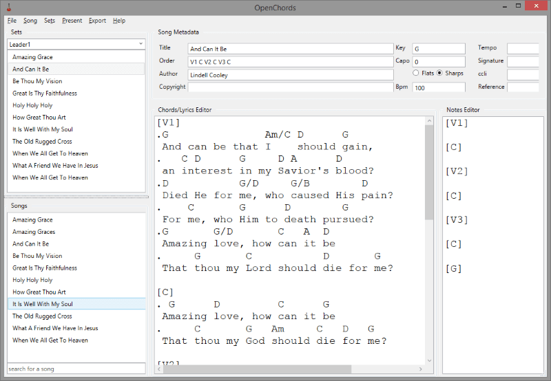
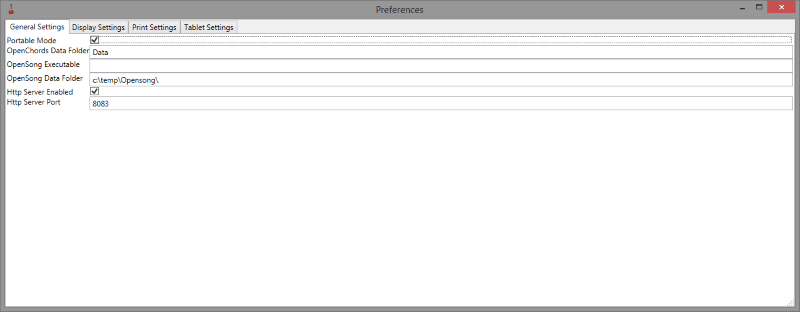
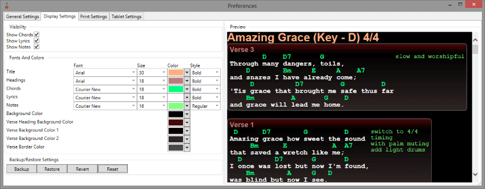
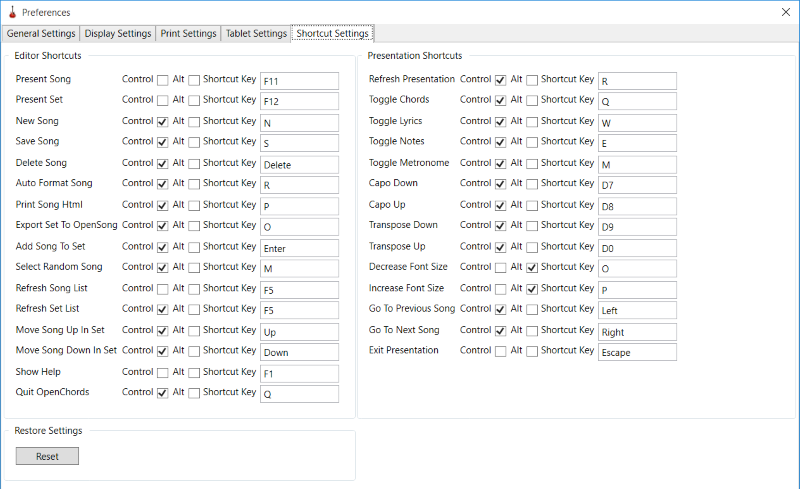
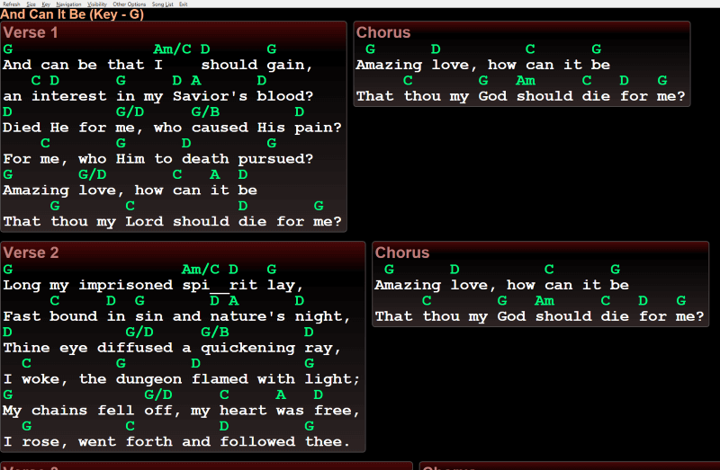
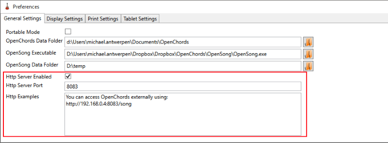
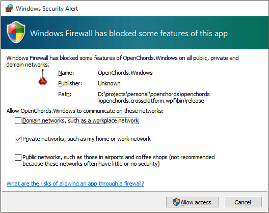

% OpenChords Help Documentation
% Author: Michael van Antwerpen
% Date: 2015-12-17

Overview
========

OpenChords is a song chords management and presentation tool for musicians. Allowing one to easily present songs with chords on a computer screen. It is opensource, easy to use, and has a clutter-free interface.

Background
==========

OpenChords was built to solve two primary needs: 

* Easily transpose the key of a song

* I wanted a fully paperless system because filing music is tedious

The closest application I could find is the fantastic presentation software by the name of OpenSong. OpenSong allowed me to easily transpose and make printed sheets of songs. However this didn't solve my filing issue. I was then inspired to make paperless song system for musicians. Hence, OpenChords was born.

Fast forward a few years... My whole band uses OpenChords when we play in church. I use OpenChords whenever I record. I've been developing OpenChords in my free time for for the past six years. It finally works on Linux :). I hope you enjoy using it as much as I enjoyed making it.

If you wish to contact me for suggestions or to report bugs, you can
email me at <open.chords.app@gmail.com>

Editor Screen
=============

This is the opening screen for OpenChords and this is where you will be adding and editing songs and adding these songs to sets.

Menu
---------------

Menu Items                        Description                                                       
------------------------------    -----------------------------------------------------------------
File    >> Preferences            Change application settings and configure display options         
File    >> Quite                  Exit OpenChords                                                   
Song    >> File Operations        Create/Delete/Save/Revert a song                                  
Song    >> Advanced Search        Search for a song based its title, author, lyrics etc             
Song    >> Song Key               Increase or decrease song key                                     
Song    >> Capo                   Increase or decrease song capo
Song    >> Auto Format Song       Tries to format the song in the OpenChords format
Song    >> Refresh                Refreshes the songs list
Set     >> File Operations        Create/Delete/Save/Revert a set
Set     >> Refresh                Refreshes the sets list
Present >> Present Song           Present the currently selected song in fullscreen mode
Present >> Present Set            Present the currently selected set in fullscreen mode
Export  >> Export to print        Export to html using the print display settings
Export  >> Export to tablet       Export to html using the tablet display settings
Export  >> Export to OpenSong     Export songs to be used in OpenSong
Export  >> Export set list        Exports the current set to a text file for easy printing

Song List
---------
This is the list of songs that you have in your song collection.
If you right click on the song you can use the "Add to set" context menu to add the currently selected song into the currently selected set.

>	**Tip1**: If you want to search for a song, just start typing in the search box. You can use the song name, some lyrics, the name of the author or the song reference. The list of songs will be filtered.

>	**Tip2**: If you want to see the song in the file system just click	Song >> File Operations >> Explore options and it will open Windows Explorer with that song	selected.

###Context Menu

Context Menu Item   Description
-----------------   -----------
Add To Set          Adds the currently selected song to the current set
Delete Song         Deletes the current song (note: this is not reverseable)
Select random song  Picks a random song in the list

###Shortcuts

Shortcut   Description
--------   ----------------------------
Ctrl+Enter Add current song to current set

Sets
--------

A set is simply a name for a list of songs. I usually have a set per worship leader  

###Context Menu

Context Menu Item    Description
-----------------    -----------
Move song up         Move the currently selected song up in the set list
Delete song from set Deletes the current song from the set
Move song down       Move the currently selected song down in the set list

###Shortcuts

Shortcut   Description
--------   ----------------------------
Del        Remove current song from set
Ctrl+Up    Move song up in the set list
Ctrl+Down  Move song down in the set list
F12        Present current set
Ctrl+O     Export current set to OpenSong

Song Metadata
-------------
This is information describing your song.

Title: this is just the name of your song.

Order: This is the order in which you would like the pieces of the song
to appear

~~~~~~~~~~~~~~~~~~~~~~~~~~~~~~~~~~~~~~~~~~~~~~~~~~~~~~~~~~~~~~~~~~~
e.g. V1 C V2 C2 E will display Verse 1, Chorus, Verse 2, Chorus 2,
Ending

There are a number of letters used for pieces of the song:
I = Intro or interlude
C = Chorus
P = Pre-Chorus
B = Bridge
V = Verse
E = Ending
~~~~~~~~~~~~~~~~~~~~~~~~~~~~~~~~~~~~~~~~~~~~~~~~~~~~~~~~~~~~~~~~~~~
> Note: You can use any other letters and number combinations but only the
> ones above will get converted to more user friendly names when you
> choose to present the song(s)

Author: Just the author of the song

Key: Current key of the song

Capo: Capo position

Sharps/Flats: whether you prefer using sharps or flats

Bpm: Beats per minute (used for the metronome)

Tempo: Options are very fast, fast medium, slow, very slow

Time Signature: 2/4, 3/4, 4/4 etc

CCli: Christian Copyright Licensing International

Reference: Other reference information e.g. SOF205

Chords/Lyrics Editor
--------------------
In order to display the chords and lyrics and sections properly we use a
simple syntax.

Syntax       Line description
---------    -------------
"." (dot)    a chord line
" " (space)  a lyrics line
\[x\]        name of the verse where *x* is I, C1, V6 etc

Note Editor
-----------
These notes are to remind you how to perform the song while the song is
being presented in full screen view. e.g. who is performing the song intro, when does the bass guitarist come in, who is singing solo parts in the verses.  

>	Note: Make sure that the notes are in the same order as your presentation order

The Settings Screens
====================

General Settings
----------------

>	**Note**: you can use both relative and absolute paths.

**Portable Mode** - if this is checked, OpenChords will store its settings file in the same folder where OpenChords is running from "settings.xml". Portable mode is useful if you want to run OpenChords from a flash drive

**OpenChords Data Folder** - this is the folder where OpenChords keeps
its songs, sets, display settings and exported files.

**OpenSong Executable** - The path and executable for OpenSong e.g. "C:\program files (x86)\OpenSong\OpenSong.exe"

**Opensong Songs and Sets Folder** - The path that OpenSong stores its
Songs, Sets, Backgrounds and settings. usually "c:\{userfolder}\My Documents\OpenSong"

**Http Server Enabled** - If this is enabled an embedded http server. note: you might get a firewall warning if this setting is enabled

**Http Server Port** - The port on which the embedded http server listens (default 8083)  

~~~~~~~~~~~~~~~~~~~~~~~~~~~~~~~~~~~~~~~~~~~~~~~~~~~~
e.g.
http://{your ip address}:{selected port}/song will render the currently selected song on another device
http://{your ip address}:{selected port}/set will render the currently selected set on another device
~~~~~~~~~~~~~~~~~~~~~~~~~~~~~~~~~~~~~~~~~~~~~~~~~~~~

Display/Print/Tablet Settings
-----------------------------
These settings are used to tweak how your song will display/print

**Show chords** - whether display chords when you presenting the songs

**Show lyrics** - whether to display the lyrics when you presenting the song.

**Show notes** - whether to display the song notes when you presenting the song.

**Song Orientation** - Either horizontal or vertical

**Fonts and Colors** - choose the Font, Size, Color and Font Style for almost all the elements that are displayed or printed

**Backup/Restore Settings** - here you can backup your current settings to a file, restore backed up settings or reset your display settings back to default

Shortcut Settings
-----------------------------
Customize keyboard shortcuts

>	**Note:** Not all shortcut keys will work e.g. using Ctrl+O in presentation screen will open the new window dialogue box.

Song/Set Presentation
=================

>	**Note:** Song elements are read from left to right if you using **horizontal screen orientation** otherwise the song elements will be from top to bottom

>	**Tip1**: You can use the "spacebar" key to move to the next page

>	**Tip2**: you will need to press the Escape key to leave the presentation.

###Menu

Menu Item                    Description                             
---------------------------  ---------------------------------------
Refresh                      Refresh song with song on filesystem   
Size                         Increase/Decrease font size                         
Key                          Increase or decrease song key           
Capo                         Increase or decrease song capo         
Navigation                   Go to next or previous song            
Other Options >> Metronome   Toggles the metronome                  
Song List                    List of all songs in the current set   

Hotkeys
========
There are a couple of shortcuts in OpenChords that will hopefully make your life a little easier.

 Editor shortcuts
-----------------
  Shortcut        Description
  ---------       -----------------------------------------------
  Ctrl+N          Creates a new blank song
  Ctrl+S          Saves the selected song to disk
  Ctrl+R          Attempts to fix the song formatting.
  Ctrl+F          Opens advanced song search.
  Ctrl+P          Exports and opens song in browser
  F11             Presents the selected song
  F12             Presents all songs in the set
  Ctrl+0          Increases song key                               
  Crtl+9          Decreases song key                               
  Ctrl+8          Increases capo                                
  Crtl+7          Decreases capo                                

Presentation shortcuts
----------------------
  Shortcut        Description
  ---------       -----------------------------------------------
  Up              Go to previous page
  Down/Space      Go to next page
  Ctrl+Left       Go to previous song                              
  Ctrl+Right      Go to next song                                  
  Alt+1..9        Goes to the song 1-9          
  Alt+L           List of all songs in the set                     
  Alt+O           Decreases font size                              
  Alt+P           Increases font size                              
  Ctrl+0          Increases song key                               
  Crtl+9          Decreases song key                               
  Ctrl+8          Increases capo                                
  Crtl+7          Decreases capo      
  Ctrl+Q          Toggle chords  
  Ctrl+W          Toggle lyrics
  Ctrl+E          Toggle notes
  Escape          Closes the song presentation window           
  Ctrl+M          Starts/Stops the metronome    

Tips and tricks
================

The Auto Format Song Menu Item
------------------------------

This feature attempts to transform the song that you entered in a presentable format. That is, it guesses what lines are chord lines and what lines are lyric lines etc. It also adjusts the notes in the notes panel to following the order of the song that you chose in the order text field.

You want to use this feature when:

1. Changing the song presentation order so the song notes get adjusted

2. Adding a new song so you don't have to manually identify which rows are chords

> **Note:** You can use Ctrl+R to quickly reach this feature.

Using OpenChords with Tablets and Cellphones
--------------------------------------------

OpenChords has a small embedded http server to accomplish this task.

These are the steps you need to follow to use the embedded http server:

1. Open preferences via File >> Preferences

2. Enable the **Http Server** and set the **Http Server Port**

	> Acceptable ports are in the range of 1024-65535

	

3. Restart OpenChords

4. You might get a firewall warning. **Allow Access** for private (or domain/public if you wish) networks

	

5. Connect to the OpenChords from another device using the address in the **http examples** text box

	> in this sample you would connect to **http://192.168.0.4:8083/song**

	> Note: the device you connecting to OpenChords needs to be on the same network

6. You can select the display settings to use and display the current set if you wish. See below for examples

~~~~~~~~~~~~~~~~~~~~~~~~~~~~~~~~~~~~~~~~~~~~~~~~~~~~~~~~~~~~~~~~~~~~~~~~~~~~~~~~~~~~~~~~~~~~~~~~~~~~~~~~~
http://{your ip address}:{selected port}/song will render the currently selected song on another device
http://{your ip address}:{selected port}/set will render the currently selected set on another device
http://{your ip address}:{selected port}/song/print will render the currently selected song using your selected print settings
http://{your ip address}:{selected port}/song/tablet will render the currently selected song on another device using your selected tablet settings
~~~~~~~~~~~~~~~~~~~~~~~~~~~~~~~~~~~~~~~~~~~~~~~~~~~~~~~~~~~~~~~~~~~~~~~~~~~~~~~~~~~~~~~~~~~~~~~~~~~~~~~~~

Integration with OpenSong
-------------------------

OpenChords has been built to work well with OpenSong, which is an excellent church projection software.

These are the steps you need to follow to be able to export songs and sets into OpenSong:

1. Open preferences via File >> Preferences

2. Set the location of your **OpenSong.exe** executable and the path to your **OpenSong data folder**

	> OpenSong is typically located in c:/program files (x86)/OpenSong/OpenSong.exe

	> OpenSong Data Folder is typically located in c:/users/%Your User Name%/OpenSong

	

3. Restart OpenChords

4. Select Export >> Export To OpenSong >> Export Current Set and your set will be exported to OpenSong and then OpenSong will be opened

5. Find your set in OpenSong and present your set.

6. If you want to have images for each of your songs, you will need to make a **.jpg** (not a jpeg) file with the exact same name as the song you exporting (note: filenames are case sensitive). For clarity, please see the filesystem diagram below

~~~~~~~~~~~~~~~~~~~~~~~~~~~~~~~~~~~~~~~~~~~~~~~~~~~~~~~~~~~~~~~~~~~
+-- Backgrounds
|   +--OpenChords
|      +--Be Thou My Vision.jpg
|      +--The Old Rugged Cross.jpg
+-- Sets
|	+--Leader 1
+-- Songs
|   +--OpenChords
|      +--Be Thou My Vision
|      +--The Old Rugged Cross
|      +--And Can It Be
~~~~~~~~~~~~~~~~~~~~~~~~~~~~~~~~~~~~~~~~~~~~~~~~~~~~~~~~~~~~~~~~~~~

>	In this example we have Exported Set "Leader 1" which has 3 songs "Be Thou My Vision", "The Old Rugged Cross" and "And Can It Be".  
>	The song "And Can It Be" will NOT have pre set background image because there is no corresponding "And Can It Be.jpg" file.
